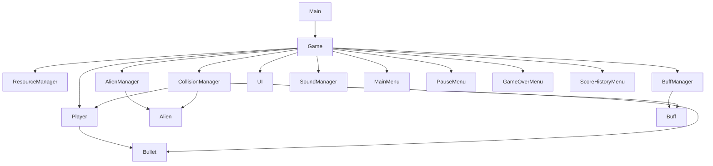
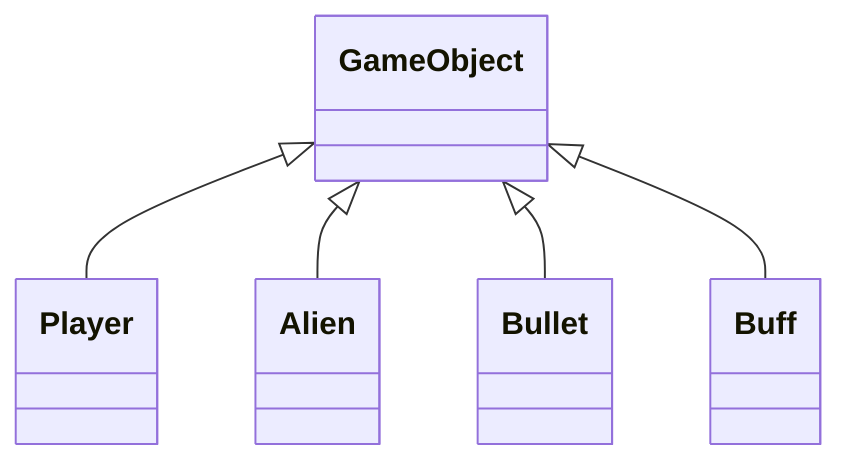
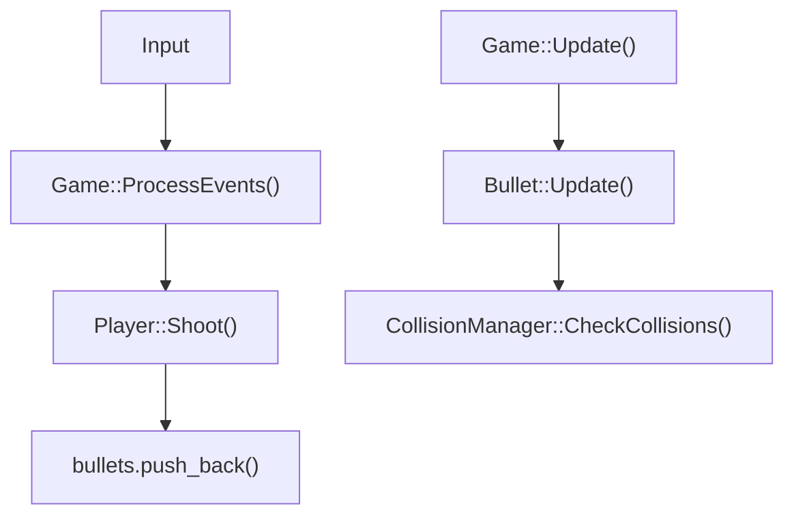
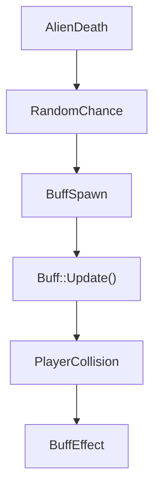
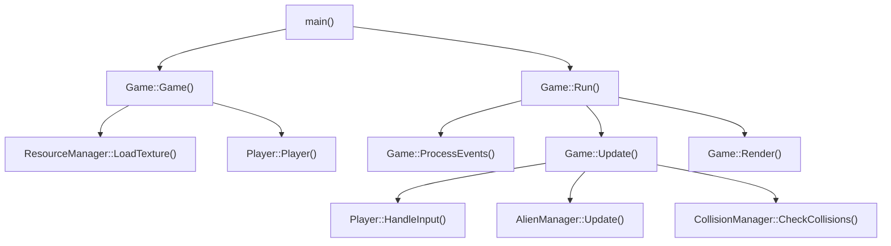

# Project Overview

- **Tên game:** Space Invaders
- **Thể loại:** Shooter 2D / Arcade
- **Mục tiêu:** Điều khiển tàu vũ trụ, tiêu diệt quái, thu buff và tồn tại qua các màn.
- **Công nghệ:** C++ với SFML3
- **Ngôn ngữ:** C++
- **Thư viện:** SFML3 (Graphics, Audio, Window)
- **Mục đích đồ án:** Xây dựng game 2D với game loop, state management, collision, UI và audio.

### Các tính năng chính

- Player movement với `WASD`/arrow keys.
- Shooting bằng `Space` hoặc click trái chuột.
- Hệ thống enemy gồm 3 round khác nhau.
- Collision detection giữa bullets, aliens, player và buff.
- Score và lives system.
- Buff system với `doubleShot`, `Shield`, `Bomb`.
- Pause menu, main menu, game over, victory và score history.
- Resource management cho texture/font.
- Sound effects và background music.

---

# 1. Project Overview

- Người chơi bước vào một cuộc chiến sinh tử giữa nhân loại và những kẻ xâm lược ngoài hành tinh. Không có lời cảnh báo, không có đàm phán – chỉ có một làn sóng quái vật không gian đang ồ ạt tiến xuống Trái Đất. 
- Người chơi đóng vai trò là tuyến phòng thủ cuối cùng, điều khiển một khẩu pháo laser đơn độc để chống lại lực lượng Alien. 

---

# 2. Features

- **Player movement:** `Player` di chuyển bằng `Left/Right/Up/Down` hoặc `A/D/W/S`.
- **Shooting:** Nhấn `Space` hoặc click trái để bắn.
- **Enemy system:** `AlienManager` tạo quái theo round: Patrol, Orbit, Boss.
- **Collision detection:** `CollisionManager` kiểm tra va chạm bằng bounding box.
- **Score system:** Tính điểm khi quái chết, boss điểm lớn hơn.
- **Lives system:** Player có 3 mạng.
- **Buff system:** Quái có 30% rơi buff gồm `doubleShot`, `Shield`, `Bomb`.
- **Audio effects:** Âm thanh bắn, nhặt, trúng đạn, enemy dead và nhạc nền.
- **Pause:** Pause menu với resume/home/volume.
- **Game states:** `MainMenu`, `Playing`, `GameOver`, `Victory`.
- **Resource management:** `ResourceManager` load texture/font.
- **History:** Lưu high score và lịch sử 5 trận gần nhất.

---

# 3. Technologies & Libraries

- **C++**: ngôn ngữ chính.
- **C++17**: sử dụng tính năng `std::optional`, lambda và container chuẩn.
- **SFML3**: dùng cho graphics, window, input, audio.
- **Compiler:** g++ (theo task trong VS Code).
- **Windows:** môi trường được sử dụng trong workspace.

---

# 4. Project Structure

```
oop/
├── assets/
│   ├── audio/
│   └── images/
├── build/
├── include/
│   ├── Alien.hpp
│   ├── AlienManager.hpp
│   ├── Buff.hpp
│   ├── BuffManager.hpp
│   ├── Bullet.hpp
│   ├── CollisionManager.hpp
│   ├── Game.hpp
│   ├── GameObject.hpp
│   ├── GameOverMenu.hpp
│   ├── GameState.hpp
│   ├── GlobalAudio.hpp
│   ├── MainMenu.hpp
│   ├── Missile.hpp
│   ├── PauseMenu.hpp
│   ├── Player.hpp
│   ├── ResourceManager.hpp
│   ├── ScoreHistoryMenu.hpp
│   ├── SoundManager.hpp
│   └── UI.hpp
├── src/
│   ├── Alien.cpp
│   ├── AlienManager.cpp
│   ├── Buff.cpp
│   ├── BuffManager.cpp
│   ├── Bullet.cpp
│   ├── CollisionManager.cpp
│   ├── Game.cpp
│   ├── GameOverMenu.cpp
│   ├── GlobalAudio.cpp
│   ├── MainMenu.cpp
│   ├── Missile.cpp
│   ├── PauseMenu.cpp
│   ├── Player.cpp
│   ├── ResourceManager.cpp
│   ├── ScoreHistoryMenu.cpp
│   ├── SoundManager.cpp
│   ├── UI.cpp
│   └── main.cpp
├── docs/
│   ├── highscore.txt
│   └── history.txt
└── README.md
```

- `assets/`: chứa ảnh, audio, font.
- `build/`: output binary.
- `include/`: khai báo class.
- `src/`: định nghĩa logic.
- `docs/highscore.txt`, `docs/history.txt`: lưu điểm.

---

# 5. Architecture Overview

## Quan hệ chính



## Inheritance



---

# 6. Program Execution Flow

### Từ `main()` đến game loop

1. `main.cpp` tạo `Game myGame;`.
2. `main.cpp` gọi `myGame.Run();`.
3. `Game::Game()` tạo window, load tài nguyên, khởi tạo `Player`, `AlienManager`, `BuffManager`, `UI`, `MainMenu`, `PauseMenu`.
4. `Run()` bắt đầu vòng lặp game chính.
5. Trong mỗi vòng lặp:
   - `ProcessEvents()` xử lý input.
   - `Update(deltaTime)` cập nhật trạng thái.
   - `Render()` vẽ scene.
6. Khi người dùng đóng cửa sổ hoặc `GameOver` và thoát menu, vòng lặp dừng.

### Chi tiết từng bước

- `main()`:
  - file entry point duy nhất.
  - tạo đối tượng `Game` và chạy `Run()`.
- `Game::Game()`:
  - `window` được tạo với kích thước 900x900.
  - load texture/font/audio.
  - tạo `Player`, `AlienManager`, `BuffManager`, `UI`, `MainMenu`, `PauseMenu`.
  - `currentState = GameState::MainMenu`.
- `Game::Run()`:
  - vòng lặp `while (window.isOpen())`.
  - tính `deltaTime`.
  - gọi `ProcessEvents()`, `Update(deltaTime)`, `Render()`.
- `ProcessEvents()`:
  - `window.pollEvent()` đọc event.
  - đóng cửa sổ nếu `sf::Event::Closed`.
  - xử lý mouse move, key pressed, mouse click.
- `Update(deltaTime)`:
  - cập nhật player, enemy, bullets, buffs.
  - kiểm tra va chạm.
  - xử lý win/lose.
- `Render()`:
  - vẽ background.
  - vẽ player, aliens, bullets, buffs, UI.
  - nếu đang menu, vẽ menu tương ứng.

---

# 7. Game Loop

### Cấu trúc thực tế

`Game::Run()` là nơi vòng lặp được thực hiện:

```cpp
while (window.isOpen())
{
    ProcessEvents();
    Update(deltaTime);
    Render();
}
```

### Input/Event Processing

- keyboard:
  - `Space`: bắn.
  - `Enter`: bắt đầu game hoặc restart.
- mouse:
  - click trái dùng để bắn và click button.
- window event:
  - đóng cửa sổ.
- pause:
  - click icon pause trong `PauseMenu`.

### Update

- `Player::HandleInput(deltaTime)`.
- `Player::Update(deltaTime)`.
- `AlienManager::Update(deltaTime)`.
- Updates cho `Bullet`, `Buff`.
- `CollisionManager::CheckCollisions(...)`.
- kiểm tra round clear hoặc game over.

### Render

- vẽ background.
- vẽ `Player`.
- vẽ `AlienManager`.
- vẽ `Bullet`.
- vẽ `BuffManager`.
- vẽ `UI`.
- vẽ menu theo `currentState`.

---

# 8. Class Documentation

## `Game`
**File:**

```
include/Game.hpp
src/Game.cpp
```

### Purpose

Điều phối toàn bộ trò chơi: vòng lặp, trạng thái, quản lý đối tượng, menu, audio, tài nguyên.

### Inheritance

Không kế thừa.

### Important Attributes

| Attribute | Type | Visibility | Purpose |
|---|---|---|---|
| `window` | `sf::RenderWindow` | private | cửa sổ hiển thị |
| `gameView` | `sf::View` | private | view game |
| `resourceManager` | `ResourceManager` | private | quản lý tài nguyên |
| `player` | `std::unique_ptr<Player>` | private | đối tượng người chơi (owned)
| `alienManager` | `std::unique_ptr<AlienManager>` | private | quản lý quái (owned)
| `bullets` | `std::vector<std::unique_ptr<Bullet>>` | private | đạn đang tồn tại (owned)
| `missiles` | `std::vector<std::unique_ptr<Missile>>` | private | missile hiện có (owned)
| `buffManager` | `std::unique_ptr<BuffManager>` | private | quản lý buff (owned)
| `collisionManager` | `CollisionManager` | private | xử lý va chạm (non-owning interface)
| `gameUI` | `std::unique_ptr<UI>` | private | giao diện người chơi (owned)
| `soundManager` | `std::unique_ptr<SoundManager>` | private | quản lý âm thanh (owned)
| `backgroundSprite` | `sf::Sprite` | private | sprite background (owned)
| `explosionSprite` | `sf::Sprite` | private | sprite explosion (owned)
| `currentState` | `GameState` | private | trạng thái game |
| `highScore` | `int` | private | điểm cao |
| `mainMenu` | `MainMenu*` | private | menu chính |
| `gameOverMenu` | `GameOverMenu*` | private | menu game over |
| `pauseMenu` | `PauseMenu*` | private | menu pause |
| `scoreHistoryMenu` | `ScoreHistoryMenu*` | private | menu lịch sử điểm |
| `viewingHistory` | `bool` | private | đang xem lịch sử |
| `matchHistory` | `std::vector<int>` | private | danh sách điểm gần nhất |
| `isPaused` | `bool` | private | pause state |

### Important Methods

| Function | Return | Purpose |
|---|---|---|
| `Game()` |  | constructor, load asset, init object |
| `~Game()` |  | destructor, delete object |
| `void Run()` | void | vòng lặp chính |
| `void ProcessEvents()` | void | xử lý input và menu |
| `void Update(float)` | void | cập nhật gameplay |
| `void CleanUpDeadEntities()` | void | xóa các entity đã inactive |
| `void Render()` | void | vẽ scene |
| `void RestartGame()` | void | reset game state |
| `void LoadHighScore()` | void | load `docs/highscore.txt` |
| `void LoadHistory()` | void | load `docs/history.txt` |
| `void SaveHighScore()` | void | lưu điểm cao vào `docs/highscore.txt` |
| `void SaveHistory()` | void | lưu lịch sử vào `docs/history.txt` |
| `sf::Texture* GetAlienTextureForRound(int)` | `sf::Texture*` | trả texture phù hợp round |

### Chi tiết

- `Game::Game()` tạo window 900x900, thiết lập view và load texture/font/audio.
- `Game::Run()` là vòng lặp chính.
- `Game::ProcessEvents()` xử lý mọi event SFML, click chuột, phím, và menu.
- `Game::Update(deltaTime)` cập nhật player, aliens, bullets, buffs, collision, game state.
- `Game::Render()` vẽ background, game object và UI/menu.

## `GameObject`
**File:**

```
include/GameObject.hpp
```

### Purpose

Base class trừu tượng cho các đối tượng có `sprite`, vị trí và trạng thái active.

### Inheritance

Không kế thừa.

### Important Attributes

| Attribute | Type | Visibility | Purpose |
|---|---|---|---|
| `position` | `sf::Vector2f` | protected | vị trí |
| `sprite` | `sf::Sprite` | protected | sprite |
| `isActive` | `bool` | protected | trạng thái tồn tại |

### Important Methods

| Function | Return | Purpose |
|---|---|---|
| `virtual void Update(float)` | pure virtual | cập nhật object |
| `virtual void Render(sf::RenderWindow&)` | pure virtual | vẽ object |
| `bool IsActive()` | bool | kiểm tra active |
| `void Destroy()` | void | đánh dấu inactive |
| `sf::FloatRect GetBounds()` | sf::FloatRect | bounding box |
| `sf::Vector2f GetPosition() const` | sf::Vector2f | vị trí |

## `Player`
**File:**

```
include/Player.hpp
src/Player.cpp
```

### Purpose

Điều khiển tàu người chơi, xử lý input, bắn đạn, buff và tính trạng thái.

### Inheritance

```
GameObject
   ↓
Player
```

### Important Attributes

| Attribute | Type | Visibility | Purpose |
|---|---|---|---|
| `speed` | float | private | tốc độ di chuyển |
| `lives` | int | private | số mạng |
| `score` | int | private | điểm hiện tại |
| `fireCooldown` | float | private | khoảng thời gian giữa 2 lần bắn |
| `currentCooldown` | float | private | thời gian chờ bắn |
| `doubleShot` | bool | private | buff double shot |
| `shield` | bool | private | buff shield |
| `shieldTexture` | sf::Texture* | private | texture shield |
| `doubleShotTimer` | float | private | thời gian double shot |
| `shieldTimer` | float | private | thời gian shield |
| `shieldHitsRemaining` | int | private | số hits shield chịu được |
| `bombReady` | bool | private | bomb sẵn sàng |
| `bombTimer` | float | private | timer bomb |
| `bombCount` | int | public | số bomb |

### Important Methods

| Function | Return | Purpose |
|---|---|---|
| `void Update(float)` | void | cập nhật cooldown, buff, vị trí |
| `void Render(sf::RenderWindow&)` | void | vẽ player và shield |
| `void HandleInput(float)` | void | xử lý phím di chuyển |
| `void Shoot(std::vector<std::unique_ptr<Bullet>>&, sf::Texture*)` | void | tạo bullet |
| `void TakeDamage()` | void | nhận sát thương |
| `void ActivateDoubleShot()` | void | kích hoạt double shot |
| `void ActivateShield()` | void | kích hoạt shield |
| `void ActivateBomb()` | void | tăng bombCount |
| `bool IsBombReady() const` | bool | kiểm tra bomb sẵn sàng |
| `void ResetBomb()` | void | giảm bombCount khi dùng |
| `bool HasShield() const` | bool | kiểm tra shield |

### Chi tiết

- `HandleInput(deltaTime)` dùng `Keyboard::isKeyPressed` với `Left/Right/Up/Down` và `A/D/W/S`.
- Giới hạn vị trí `x` trong `[0, 900 - width]` và `y` trong `[450, 900 - height]`.
- `Update(deltaTime)` giảm `currentCooldown`, `doubleShotTimer`, `shieldTimer`, `bombTimer`.
- `Shoot(...)` tạo `Bullet` tại đầu tàu. Nếu `doubleShot` tạo 2 viên.
- `TakeDamage()` nếu có shield thì gọi `TakeShieldHit()`; nếu không thì giảm `lives` và `Destroy()` khi hết mạng. Khi mất 1 mạng (vẫn còn mạng > 0) game sẽ tự động kích hoạt hiệu ứng `shield` (tạm thời) để giúp người chơi phục hồi.
- `ActivateDoubleShot()` đặt `fireCooldown = 0.15f`, `doubleShotTimer = 10s`.
- `ActivateShield()` đặt `shieldTimer = 10s`, `shieldHitsRemaining = 2`.

## `Alien`
**File:**

```
include/Alien.hpp
src/Alien.cpp
```

### Purpose

Đại diện quái vật, xử lý di chuyển, spawn, cooldown bắn và điểm.

### Inheritance

```
GameObject
   ↓
Alien
```

### Important Attributes

| Attribute | Type | Visibility | Purpose |
|---|---|---|---|
| `pointValue` | int | private | điểm cơ bản |
| `movementType` | MovementType | private | kiểu di chuyển |
| `orbitCenter` | sf::Vector2f | private | tâm di chuyển |
| `orbitRadius` | float | private | bán kính di chuyển |
| `angle` | float | private | góc orbit |
| `spawnDelay` | float | private | delay spawn |
| `spawnTimer` | float | private | timer spawn |
| `hasSpawned` | bool | private | đã spawn chưa |
| `aliveTimer` | float | private | thời gian sống |
| `survivalTime` | float | private | dùng tính điểm |
| `entryStartPos` | sf::Vector2f | private | vị trí vào màn |
| `shootCooldown` | float | private | cooldown bắn |
| `shootTimer` | float | private | timer bắn |
| `maxHealth` | int | private | HP tối đa |
| `currentHealth` | int | private | HP hiện tại |

### Important Methods

| Function | Return | Purpose |
|---|---|---|
| `void Update(float)` | void | update spawn, movement, cooldown |
| `void Render(sf::RenderWindow&)` | void | vẽ alien |
| `void MoveDown(float)` | void | di chuyển xuống |
| `void MoveHorizontal(float)` | void | di chuyển ngang |
| `bool CanShoot()` | bool | kiểm tra cooldown |
| `void ResetShootCooldown()` | void | reset timer bắn |
| `void TakeDamage(int)` | void | giảm HP và destroy |
| `int CalculateBossHitScore() const` | int | điểm bắn trúng boss |
| `int CalculateBossKillScore() const` | int | điểm giết boss |
| `int CalculateNormalScore() const` | int | điểm giết quái thường |

### Chi tiết

- `MovementType::Patrol`: alien di chuyển ngang đồng bộ.
- `MovementType::Orbit`: alien bay quanh center.
- `MovementType::Boss`: boss di chuyển ngang theo sin.
- `CanShoot()` trả true khi `shootTimer <= 0` và đã spawn.
- `TakeDamage(1)` giảm HP và `Destroy()` nếu HP ≤ 0.
- `CalculateNormalScore()` giảm theo thời gian tồn tại, không thấp hơn 10.

## `AlienManager`
**File:**

```
include/AlienManager.hpp
src/AlienManager.cpp
```

### Purpose

Tạo, quản lý và vẽ quái. Điều khiển round và bắn của quái.

### Inheritance

Không kế thừa.

### Important Attributes

| Attribute | Type | Visibility | Purpose |
|---|---|---|---|
| `aliens` | std::vector<std::unique_ptr<Alien>> | private | danh sách quái (owned)
| `moveSpeed` | float | private | tốc độ di chuyển ngang round 1 |
| `movingRight` | bool | private | hướng di chuyển |
| `currentRound` | int | private | round hiện tại |
| `maxRounds` | int | private | số round tối đa |

### Important Methods

| Function | Return | Purpose |
|---|---|---|---|
| `void InitializeSwarm(sf::Texture*)` | void | tạo quái theo round |
| `void Update(float)` | void | cập nhật quái |
| `void Render(sf::RenderWindow&)` | void | vẽ quái |
| `void AlienShoot(std::vector<std::unique_ptr<Bullet>>&, sf::Texture*)` | void | quái bắn |
| `bool IsRoundCleared()` | bool | kiểm tra hết quái |
| `bool IsFinalRound()` | bool | kiểm tra final round |
| `void StartNextRound(sf::Texture*)` | void | tạo round mới |
| `void Reset(sf::Texture*)` | void | reset game |

### Chi tiết

- Round 1: 4x8 quái `Patrol`.
- Round 2: 5x9 quái `Orbit`.
- Round 3: 1 boss `Boss`.
- `Update()` round 1 xử lý di chuyển swarm ngang và đổi hướng.
- `AlienShoot()` giới hạn số đạn quái dựa trên round và tạo đạn thẳng hoặc tỏa góc cho boss.

## `Bullet`
**File:**

```
include/Bullet.hpp
src/Bullet.cpp
```

### Purpose

Đại diện viên đạn, di chuyển và tự destroy khi ra khỏi màn.

### Inheritance

```
GameObject
   ↓
Bullet
```

### Important Attributes

| Attribute | Type | Visibility | Purpose |
|---|---|---|---|
| `velocity` | sf::Vector2f | private | vận tốc đạn |
| `isPlayerBullet` | bool | private | phân biệt đạn player/quái |

### Important Methods

| Function | Return | Purpose |
|---|---|---|---|
| `void Update(float)` | void | di chuyển đạn, destroy khi ra khỏi màn |
| `void Render(sf::RenderWindow&)` | void | vẽ đạn |
| `bool IsPlayerBullet()` | bool | kiểm tra loại đạn |

### Chi tiết

- `Update()` cộng `velocity * deltaTime` vào `position`.
- Destroy khi `position.y < 0` hoặc `position.y > 900`.

## `Buff`
**File:**

```
include/Buff.hpp
src/Buff.cpp
```

### Purpose

Đại diện power-up rơi từ quái chết.

### Inheritance

```
GameObject
   ↓
Buff
```

### Important Attributes

| Attribute | Type | Visibility | Purpose |
|---|---|---|---|
| `type` | BuffType | private | loại buff |
| `fallSpeed` | float | private | tốc độ rơi |

### Important Methods

| Function | Return | Purpose |
|---|---|---|---|
| `void Update(float)` | void | di chuyển xuống |
| `void Render(sf::RenderWindow&)` | void | vẽ buff |
| `BuffType GetType() const` | BuffType | trả loại |

### Chi tiết

- `Update()` tăng `position.y`.
- Destroy nếu rơi qua `y > 920`.

## `BuffManager`
**File:**

```
include/BuffManager.hpp
src/BuffManager.cpp
```

### Purpose

Quản lý tập buff đang tồn tại.

### Inheritance

Không kế thừa.

### Important Attributes

| Attribute | Type | Visibility | Purpose |
|---|---|---|---|
| `buffs` | std::vector<std::unique_ptr<Buff>> | private | danh sách buff (owned) |

### Important Methods

| Function | Return | Purpose |
|---|---|---|---|
| `void SpawnBuff(sf::Texture*, sf::Vector2f, BuffType)` | void | tạo buff |
| `void Update(float)` | void | cập nhật buffs |
| `void Render(sf::RenderWindow&)` | void | vẽ buffs |
| `void CleanUp()` | void | xóa buff inactive |
| `std::vector<std::unique_ptr<Buff>>& GetBuffs()` | vector<std::unique_ptr<Buff>>& | truy xuất buff |

### Chi tiết

- `SpawnBuff()` thêm buff mới.
- `Update()` gọi `Update()` từng buff và xóa buff destroyed.
- `CleanUp()` xóa phần tử inactive từ cuối vector.

## `CollisionManager`
**File:**

```
include/CollisionManager.hpp
src/CollisionManager.cpp
```

### Purpose

Xử lý va chạm giữa player, alien, bullet và buff.

### Inheritance

Không kế thừa.

### Important Methods

| Function | Return | Purpose |
|---|---|---|---|
| `void CheckCollisions(...)` | void | kiểm tra mọi va chạm |
| `void AwardScore(Player*, Alien*)` | void | cộng điểm khi kill alien |

### Chi tiết

- Player bullet vs Alien: `findIntersection()` kiểm tra bounding box.
- Alien bullet vs Player: trúng player thì giảm mạng/shield và destroy bullet.
- Player vs Buff: trúng buff thì activate effect.
- Spawn buff 50% khi alien chết.
- Score:
  - Normal alien tính `CalculateNormalScore()`.
  - Boss tính `CalculateBossHitScore()` và `CalculateBossKillScore()`.

## `ResourceManager`
**File:**

```
include/ResourceManager.hpp
src/ResourceManager.cpp
```

### Purpose

Load và cache texture/font.

### Inheritance

Không kế thừa.

### Important Attributes

| Attribute | Type | Visibility | Purpose |
|---|---|---|---|
| `textures` | std::map<std::string, sf::Texture*> | private | lưu texture |
| `fonts` | std::map<std::string, sf::Font*> | private | lưu font |

### Important Methods

| Function | Return | Purpose |
|---|---|---|---|
| `void LoadTexture(std::string, std::string)` | void | load texture |
| `sf::Texture* GetTexture(std::string)` | sf::Texture* | lấy texture |
| `void LoadFont(std::string, std::string)` | void | load font |
| `sf::Font* GetFont(std::string)` | sf::Font* | lấy font |

### Chi tiết

- `LoadTexture()` load texture từ file và lưu vào map.
- `GetTexture()` trả `nullptr` nếu không tìm.
- Destructor xóa pointer trong map.

## `SoundManager`
**File:**

```
include/SoundManager.hpp
src/SoundManager.cpp
```

### Purpose

Quản lý hiệu ứng âm thanh và nhạc nền.

### Inheritance

Không kế thừa.

### Important Attributes

| Attribute | Type | Visibility | Purpose |
|---|---|---|---|
| `soundBuffers` | std::map<std::string, sf::SoundBuffer*> | private | buffer âm thanh |
| `sounds` | std::map<std::string, sf::Sound*> | private | sound effect |
| `music` | sf::Music | private | nhạc nền |
| `volume` | float | private | âm lượng |
| `isMuted` | bool | private | trạng thái mute |

### Important Methods

| Function | Return | Purpose |
|---|---|---|
| `void LoadSound(std::string, std::string)` | void | load sound effect |
| `void LoadMusic(std::string)` | void | load nhạc nền |
| `void Play(std::string)` | void | phát effect |
| `void PlayMusic()` | void | phát nhạc |
| `void UpdateVolume()` | void | cập nhật volume |

### Chi tiết

- `LoadSound()` tạo `SoundBuffer` và `Sound`.
- `LoadMusic()` mở file nhạc.
- `Play()` phát effect nếu không mute.

## `UI`
**File:**

```
include/UI.hpp
src/UI.cpp
```

### Purpose

Hiển thị score, lives, buff timers và màn hình Game Over/Victory.

### Inheritance

Không kế thừa.

### Important Attributes

| Attribute | Type | Visibility | Purpose |
|---|---|---|---|
| `font` | sf::Font* | private | font hiển thị |
| `scoreText` | sf::Text | private | điểm |
| `heartTexture` | sf::Texture | private | icon mạng |
| `shieldText` | sf::Text | private | thời gian shield |
| `doubleShotText` | sf::Text | private | thời gian double shot |
| `overlay` | sf::RectangleShape | private | overlay game over |
| `state` | GameState | private | trạng thái hiển thị |

### Important Methods

| Function | Return | Purpose |
|---|---|---|
| `void Update(Player*, GameState, int)` | void | cập nhật UI |
| `void Render(sf::RenderWindow&)` | void | vẽ UI |

### Chi tiết

- `Update()` đồng bộ score/lives và buff timers.
- `Render()` vẽ hearts, icon shield, icon double shot khi active.
- Khi `GameOver` hoặc `Victory`, vẽ overlay và text.

## `MainMenu`
**File:**

```
include/MainMenu.hpp
src/MainMenu.cpp
```

### Purpose

Hiển thị menu chính và xử lý start/history/volume.

### Inheritance

Không kế thừa.

### Important Attributes

| Attribute | Type | Visibility | Purpose |
|---|---|---|---|
| `bgSprite` | sf::Sprite* | private | background |
| `logoSprite` | sf::Sprite* | private | logo |
| `playSprite` | sf::Sprite* | private | nút play |
| `historySprite` | sf::Sprite* | private | nút history |
| `muteButtonSprite` | sf::Sprite* | private | nút mute |
| `volumeUpSprite` | sf::Sprite* | private | tăng volume |
| `volumeDownSprite` | sf::Sprite* | private | giảm volume |
| `isMuted` | bool | private | mute state |
| `currentVolume` | int | private | volume |

### Important Methods

| Function | Return | Purpose |
|---|---|---|
| `void Update(sf::Vector2f)` | void | hover effect |
| `int HandleClick(sf::Vector2f)` | int | xử lý click |
| `void Render(sf::RenderWindow&)` | void | vẽ menu |
| `void SetVolume(int, bool)` | void | set volume |
| `bool IsMuted() const` | bool | kiểm tra mute |

### Chi tiết

- `HandleClick()` trả:
  - `1` để play.
  - `2` để xem history.
  - `3` toggle mute.
  - `4`/`5` volume down/up.

## `PauseMenu`
**File:**

```
include/PauseMenu.hpp
src/PauseMenu.cpp
```

### Purpose

Hiển thị menu pause và điều chỉnh âm lượng.

### Inheritance

Không kế thừa.

### Important Attributes

| Attribute | Type | Visibility | Purpose |
|---|---|---|---|
| `backgroundOverlay` | sf::RectangleShape | private | overlay |
| `menuBgSprite` | sf::Sprite* | private | khung menu |
| `pauseSprite` | sf::Sprite* | private | icon pause |
| `resumeSprite` | sf::Sprite* | private | nút resume |
| `homeSprite` | sf::Sprite* | private | nút home |
| `muteSprite` | sf::Sprite* | private | mute icon |
| `volumeText` | sf::Text | private | hiển thị % |
| `volume` | float | private | volume |
| `isMuted` | bool | private | mute state |

### Important Methods

| Function | Return | Purpose |
|---|---|---|
| `bool IsPauseButtonClicked(sf::Vector2f)` | bool | kiểm tra click pause |
| `void Update(sf::Vector2f)` | void | hover effect |
| `int HandleClick(sf::Vector2f)` | int | xử lý click |
| `void Render(sf::RenderWindow&, bool)` | void | vẽ pause menu |
| `void SetVolume(float, bool)` | void | set volume |

### Chi tiết

- `HandleClick()` trả `1` resume, `2` home, `3` pause icon.
- `Render()` vẽ icon pause và menu overlay khi pause.

## `GameOverMenu`
**File:**

```
include/GameOverMenu.hpp
src/GameOverMenu.cpp
```

### Purpose

Hiển thị màn game over / victory và cho phép restart hoặc về main menu.

### Inheritance

Không kế thừa.

### Important Attributes

| Attribute | Type | Visibility | Purpose |
|---|---|---|---|
| `titleSprite` | sf::Sprite* | private | victory/defeat image |
| `finalScoreText` | sf::Text | private | điểm cuối |
| `restartSprite` | sf::Sprite* | private | nút restart |
| `menuSprite` | sf::Sprite* | private | nút về main menu |

### Important Methods

| Function | Return | Purpose |
|---|---|---|
| `void Update(sf::Vector2f)` | void | hover effect |
| `int HandleClick(sf::Vector2f)` | int | xử lý click |
| `void Render(sf::RenderWindow&)` | void | vẽ menu |

### Chi tiết

- `HandleClick()` trả `1` nếu restart, `2` nếu về menu.

## `ScoreHistoryMenu`
**File:**

```
include/ScoreHistoryMenu.hpp
src/ScoreHistoryMenu.cpp
```

### Purpose

Hiển thị 5 trận gần nhất trong lịch sử.

### Inheritance

Không kế thừa.

### Important Attributes

| Attribute | Type | Visibility | Purpose |
|---|---|---|---|
| `backgroundOverlay` | sf::RectangleShape | private | overlay |
| `menuBgSprite` | sf::Sprite* | private | khung menu |
| `titleText` | sf::Text | private | tiêu đề |
| `backSprite` | sf::Sprite* | private | nút back |
| `scoreTexts` | std::vector<sf::Text> | private | hiển thị điểm |

### Important Methods

| Function | Return | Purpose |
|---|---|---|
| `void Update(sf::Vector2f)` | void | hover effect |
| `bool IsBackButtonClicked(sf::Vector2f)` | bool | kiểm tra click back |
| `void Render(sf::RenderWindow&)` | void | vẽ menu |

### Chi tiết

- Hiển thị tối đa 5 trận. Nếu ít, điền `0 pts`.

---

# 9. Class Relationships

- `Game` sở hữu `Player`, `AlienManager`, `BuffManager`, `UI`, `SoundManager`, `MainMenu`, `PauseMenu`, `GameOverMenu`, `ScoreHistoryMenu`.
- `AlienManager` chứa `std::vector<std::unique_ptr<Alien>>` (owned).
- `Game` chứa `std::vector<std::unique_ptr<Bullet>> bullets` và `std::vector<std::unique_ptr<Missile>> missiles` (owned).
- `BuffManager` chứa `std::vector<std::unique_ptr<Buff>>` (owned).
- `CollisionManager` nhận tham chiếu/pointer đến các đối tượng để kiểm tra va chạm.
- `Player::Shoot()` thêm bullet vào vector do `Game` quản lý.
- `AlienManager::AlienShoot()` cũng thêm bullet vào cùng vector.

---

# 10. Inheritance & Polymorphism

- `GameObject` là base class với `Update(float)` và `Render(sf::RenderWindow&)` là pure virtual.
- `Player`, `Alien`, `Bullet`, `Buff` kế thừa `GameObject`.
- Polymorphism hiện diện qua override các hàm `Update` và `Render`.
- Project không dùng container `GameObject*` chung nên polymorphism chỉ diễn ra ở cấp độ class chứ không phải qua một container duy nhất.

---

# 11. Game Object System

- `Player`: có position, sprite, tốc độ, lives, score, buff state.
- `Alien`: có spawn delay, movement type, health, scoring, shoot cooldown.
- `Bullet`: có velocity và flag `isPlayerBullet`.
- `Buff`: rơi xuống, có type và fall speed.
- `AlienManager`: quản lý vòng đời quái.
- `BuffManager`: quản lý và xóa buffs.

---

# 12. Player System

### Movement

- `Player::HandleInput(float deltaTime)` xử lý `Left/Right/Up/Down` và `A/D/W/S`.
- Giới hạn di chuyển trong khu vực dưới màn.

### Shooting

- `Space` và click trái gọi `Player::Shoot(...)`.
- `Player::Shoot()` tạo bullet player với vận tốc `-500`.
- `doubleShot` tạo 2 bullet.

### Cooldown

- `fireCooldown = 0.3f`.
- `currentCooldown` giảm trong `Player::Update()`.
- `doubleShot` có timer 10 giây.

### Lives

- `lives = 3`.
- `Player::TakeDamage()` giảm mạng hoặc xử lý shield.
- Khi `lives <= 0`, `Destroy()`.

### Buffs

- `ActivateDoubleShot()`: giảm cooldown, bắn đôi.
- `ActivateShield()`: shield tồn tại 10s và chịu 2 hits.
- `ActivateBomb()`: tăng `bombCount`.

### Shield

- khi shield active, `TakeDamage()` gọi `TakeShieldHit()`.
- shield có `shieldHitsRemaining`.

---

# 13. Enemy System

### Spawn

- `AlienManager::InitializeSwarm(sf::Texture*)` tạo quái theo round.
- `Game::Game()` gọi hàm này để tạo round 1.

### Movement

- Round 1: `Patrol` với di chuyển ngang đồng bộ.
- Round 2: `Orbit` quay vòng quanh tâm.
- Round 3: `Boss` di chuyển ngang theo sin.

### Destroy

- `CollisionManager` xử lý khi bullet player trúng.
- `Alien::TakeDamage(int)` giảm health và gọi `Destroy()` nếu ≤ 0.

### Attack

- `AlienManager::AlienShoot()` tạo đạn quái.
- Boss bắn 5 viên tỏa góc, quái thường bắn 1 viên thẳng.

### Buff spawn

- Khi alien chết, 50% chance spawn buff.
- Random 3 loại: `doubleShot`, `Shield`, `Bomb`.

---

# 14. Bullet System

### Tạo

- Player: `Player::Shoot(...)`.
- Alien: `AlienManager::AlienShoot(...)`.

### Hướng bay

- Player: `velocity(0, -500)`.
- Alien: `velocity(0, 150 + (currentRound - 1) * 75)`.
- Boss: 5 viên tỏa góc.

### Update

- `Bullet::Update(float)` di chuyển theo velocity.
- Destroy khi ra khỏi màn.

### Collision

- `CollisionManager::CheckCollisions()` kiểm tra bullet vs alien và bullet vs player.

---

# 15. Buff / Power-up System

### Cơ chế

- Quái chết có 30% rơi buff.
- `BuffManager::SpawnBuff()` tạo buff.
- `Buff::Update()` cho buff rơi.
- `CollisionManager` kiểm tra player nap buff.

### Loại buff

- `doubleShot`: `Player::ActivateDoubleShot()`.
- `Shield`: `Player::ActivateShield()`.
- `Bomb`: `Player::ActivateBomb()`.

---

# 16. Collision System

### Trường hợp va chạm

- `Player Bullet → Alien`.
- `Alien Bullet → Player`.
- `Player → Buff`.

### Cách kiểm tra

- Dùng `sf::FloatRect::findIntersection()`.
- Duyệt từng bullet, kiểm tra với từng alien hoặc player.

### Xử lý

- Player bullet trúng alien: `alien->TakeDamage(1)`, `bullet->Destroy()`, cộng điểm.
- Alien bullet trúng player: `player->TakeDamage()`; if the player has an active shield the game plays `soundManager.Play("shield")`, otherwise it plays `soundManager.Play("hit")`; then `bullet->Destroy()`.
- Player trúng buff: gọi activate effect và `buff->Destroy()`.

---

# 17. Resource Management

- `ResourceManager` load texture và font.
- `LoadTexture()` tạo `sf::Texture*` và lưu vào map `textures`.
- `GetTexture()` trả pointer theo tên.
- `LoadFont()` tương tự.
- Destructor xóa pointer.

Lợi ích: tránh load lại, truy xuất tài nguyên theo tên, tái sử dụng.

---

# 18. Audio System

- `SoundManager` quản lý `soundBuffers` và `sounds`.
- `LoadSound()` và `LoadMusic()` load audio từ file.
- `Play()` phát hiệu ứng, `PlayMusic()` phát nhạc nền.
- `PauseMenu` và `MainMenu` cập nhật `GlobalAudio`.

---

# 19. UI System

- `UI::Update(Player*, GameState, int)` đồng bộ score, lives, shield, double shot.
- `UI::Render()` vẽ score, hearts, icon buff và overlay game over/victory.

---

# 20. Game State / Menu System

- `GameState::MainMenu`
- `GameState::Playing`
- `GameState::GameOver`
- `GameState::Victory`

### Chuyển trạng thái

- Main menu -> Playing: nhấn `Enter` hoặc click play.
- Playing -> GameOver: player hết mạng.
- Playing -> Victory: `AlienManager::IsRoundCleared()` và là final round.
- Pause bật/tắt bằng click icon pause.

---

# 21. Detailed Feature Flow

### Shooting



### Buff



---

# 22. Important Function Call Flow



---


# 23. How To Modify The Game

### Thay đổi Player speed

- File: `include/Player.hpp`, `src/Player.cpp`.
- Biến: `speed`.
- Hàm: `Player::HandleInput(float deltaTime)`.

### Thay đổi tốc độ bullet

- File: `src/Player.cpp` và `src/AlienManager.cpp`.
- Giảm `velocity` của bullet player hoặc alien.

### Thay đổi tỷ lệ drop buff

- File: `src/CollisionManager.cpp`.
- Cấu hình `if (rand() % 100 < 50)`.

### Thêm loại buff

- File: `include/Buff.hpp`, `src/Buff.cpp`, `src/CollisionManager.cpp`, `src/Game.cpp`.
- Thêm giá trị vào `BuffType` và xử lý tương ứng.

### Thêm enemy type

- File: `include/Alien.hpp`, `src/Alien.cpp`, `src/AlienManager.cpp`.
- Thêm `MovementType` mới và logic spawn.

### Thay đổi score

- File: `src/CollisionManager.cpp`.
- Sửa `AwardScore()`, `CalculateNormalScore()`, `CalculateBossHitScore()`, `CalculateBossKillScore()`.

### Thêm sound

- File: `src/Game.cpp`, `src/SoundManager.cpp`.
- Load sound mới và gọi `soundManager.Play(...)`.

### Thêm UI

- File: `include/UI.hpp`, `src/UI.cpp`.
- Thêm text/sprite và cập nhật trong `UI::Update()` / `UI::Render()`.

---

# 24. Build & Run

### Requirements

- C++ compiler hỗ trợ C++17.
- SFML3.
- Windows.

### Build

Dự án không chứa `CMakeLists.txt` nhưng task VS Code dùng g++:

```bash
g++ -std=c++17 src/*.cpp -I include -o build/main.exe -I C:/msys64/ucrt64/include -L C:/msys64/ucrt64/lib -lsfml-graphics -lsfml-window -lsfml-system -lsfml-audio
```

### Run

```bash
build/main.exe
```

---

# 25. Controls

| Key | Action |
|---|---|
| `Left` / `A` | Move left |
| `Right` / `D` | Move right |
| `Up` / `W` | Move up |
| `Down` / `S` | Move down |
| `Space` | Shoot |
| `Mouse left click` | Shoot / click buttons |
| `Enter` | Start / restart |

---

# 26. OOP Concepts Used

- **Encapsulation**: `AlienManager`, `BuffManager`, `CollisionManager`, `SoundManager`, `ResourceManager` giữ dữ liệu private.
- **Inheritance**: `GameObject` là base class, `Player`, `Alien`, `Bullet`, `Buff` kế thừa.
- **Abstraction**: `Game` điều phối game, `ResourceManager` ẩn chi tiết load tài nguyên.
- **Composition**: `Game` chứa các manager và đối tượng.
- **Dependency**: `CollisionManager` phụ thuộc vào `Player`, `Alien`, `Bullet`, `Buff`, `SoundManager`.

---

# 27. Design Patterns

- Manager pattern xuất hiện ở `AlienManager`, `BuffManager`, `CollisionManager`, `ResourceManager`, `SoundManager`.

---

# 28. Memory & Pointer Management

- Nhiều ownership đã được chuyển sang `std::unique_ptr` (ví dụ: `Game` sở hữu `Player`, `AlienManager`, `BuffManager`, `UI`, menus và `SoundManager`).
- Các container sở hữu giờ dùng `std::vector<std::unique_ptr<T>>` cho `Bullet`, `Missile`, `Alien`, `Buff`.
- Vẫn còn các con trỏ không sở hữu (non-owning raw pointers hoặc tham chiếu) được dùng làm interface giữa manager và các hàm kiểm tra va chạm.

---

# 29. Error Handling & Edge Cases

- `ResourceManager` in lỗi nếu load texture/font thất bại.
- `UI/menu` in lỗi nếu load image thất bại.
- `Bullet` destroy khi ra khỏi màn.
- `Buff` destroy khi rơi xuống dưới màn.
- `Game::ProcessEvents()` đóng cửa sổ khi event `Closed`.
- `AlienManager::IsRoundCleared()` kiểm tra hết quái.

---

# 30. Performance Considerations

- `Collision O(n*m)` khi duyệt từng bullet và từng alien.
- `AlienManager::Update()` duyệt từng alien và kiểm tra biên giới.
- `BuffManager::CleanUp()` xóa từ cuối vector, tối ưu.
- `ResourceManager` chỉ load tài nguyên một lần.

---

# 31. Testing Guide

- Test Player Movement:
  - Input: `WASD` / arrow keys.
  - Expected: player di chuyển, không ra khỏi khu vực.
- Test Shooting:
  - Input: `Space` hoặc click trái.
  - Expected: bullets xuất hiện và bay lên.
- Test Alien Collision:
  - Hành động: bắn quái.
  - Expected: quái giảm HP và chết, điểm tăng.
- Test Buff Drop:
  - Hành động: giết alien.
  - Expected: có buff rơi 30%.
- Test Shield:
  - Hành động: nhặt shield và bị trúng đạn.
  - Expected: shield chịu 2 lần, sau đó mất.
- Test Double Shot:
  - Hành động: nhặt double shot.
  - Expected: bắn 2 viên.
- Test Game Over:
  - Hành động: mất 3 mạng.
  - Expected: chuyển sang `GameOver`.
- Test Pause:
  - Input: click icon pause.
  - Expected: hiển thị pause menu, gameplay tạm dừng.

---

# 32. Known Limitations

- Dùng raw pointer nhiều, dễ lỗi memory management.
- Không có `CMakeLists.txt` trong source.
- Một số logic menu và game state có coupling cao.

---

# 33. Future Improvements

- Chuyển raw pointer sang smart pointers (`std::unique_ptr`, `std::shared_ptr`).
- Thêm `CMakeLists.txt` để build dễ dàng.
- Tối ưu collision bằng spatial partition.
- Hoàn thiện `Missile` hoặc bomb effect.
- Thêm state machine rõ ràng cho menu và game states.
- Thêm animation sprite sheet.
- Thêm file config cho key bindings và tốc độ.
- Thêm save/load hoặc settings in-game.

---

# 34. Conclusion

Dự án là một game shooter 2D SFML C++ với cấu trúc rõ ràng:

- `Game` điều phối vòng lặp và trạng thái.
- `Player`, `Alien`, `Bullet`, `Buff` kế thừa `GameObject`.
- `AlienManager` tạo và update quái.
- `CollisionManager` xử lý va chạm và điểm.
- `ResourceManager` quản lý texture/font.
- UI/menu đầy đủ cho play/pause/game over/history.
- Audio và save score/history.

---

# 35. TÀI LIỆU THAM KHẢO

1. **Source code ý tưởng tham khảo:**  
   https://github.com/attreyabhatt/Space-Invaders-Pygame

2. **Cảm hứng Gameplay:**  
   https://www.youtube.com/shorts/u2e5RYYej_4

3. **Github mã nguồn của nhóm:**  
   https://github.com/dnvinh2402/oop

---

# HẾT
