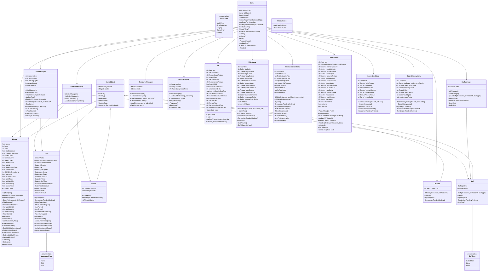

# Class Diagram

```mermaid
classDiagram
    class GameObject {
        #sf::Vector2f position
        #sf::Sprite sprite
        #IsActive()
        +Destroy()
        +GetBounds()
        +GetPosition()
        +Update(float)
        +Render(sf::RenderWindow&)
    }
    class GameState {
         <<enumeration>>
        -MainMenu
        -ShipSelection
        -Playing
        -GameOver
        -Victory
    }
    class Player {
        -float speed
        -int lives
        -int score
        -float fireCooldown
        -float currentCooldown

        -int healthLevel
        -int fireRateLevel
        -int speedLevel

        -bool doubleShot
        -bool shield
        -float doubleShotTimer
        -float shieldTimer
        -int shieldHitsRemaining

        -bool invincible
        -float invincibleTimer
        -float blinkTimer
        -bool blinkVisible

        -bool bombReady
        -float bombTimer
        +int bombCount

        +Update(float)
        +Render(sf::RenderWindow&)
        +HandleInput(float)
        +Shoot(std::vector<Bullet*>&, sf::Texture*)
        +TakeDamage()

        +ActivateDoubleShot()
        +ActivateShield()
        +ActivateBomb()
        +IsBombReady()
        +ResetBomb()

        +HasShield()
        +IsInvincible()
        +StartInvincibility(float)
        +TakeShieldHit()

        +GetShieldTimer()
        +GetShieldHitsRemaining()
        +GetInvincibleTimer()
        +GetCurrentCooldown()
        +GetDoubleShotTimer()
        +HasDoubleShot()

        +GetLives()
        +GetScore()
        +AddScore(int)
    }
    class MovementType {
        <<enumeration>>
        Patrol
        Orbit
        Boss
    }
    class Alien {
        -int pointValue
        -MovementType movementType

        -sf::Vector2f orbitCenter
        -float orbitRadius
        -float angle
        -float angularSpeed

        -float spawnDelay
        -float spawnTimer
        -bool hasSpawned
        -float aliveTimer
        -float survivalTime

        -sf::Vector2f entryStartPos

        -float shootCooldown
        -float shootTimer

        -int maxHealth
        -int currentHealth

        +Update(float)
        +Render(sf::RenderWindow&)
        +MoveDown(float)
        +MoveHorizontal(float)

        +GetPoints()
        +CanShoot()
        +ResetShootCooldown()

        +TakeDamage(int)
        +GetHealth()
        +GetMaxHealth()

        +AddSurvivalTime(float)

        +CalculateBossHitScore()
        +CalculateBossKillScore()
        +CalculateNormalScore()

        +GetMovementType()
    }

    class Bullet {
        -sf::Vector2f velocity
        -bool isPlayerBullet

        +Update(float)
        +Render(sf::RenderWindow&)
        +IsPlayerBullet()
    }
    class Missile {
        -sf::Vector2f velocity
        +Missile(sf::Texture*, sf::Vector2f)
        +~Missile()
        +Update(float)
        +Render(sf::RenderWindow&)
    }
    class Buff {
        -BuffType type
        -float fallSpeed
        +Buff(sf::Texture*, sf::Vector2f, BuffType)
        +~Buff()
        +Update(float)
        +Render(sf::RenderWindow&)
        +GetType()
    }

    class BuffType {
        <<enumeration>>
        doubleShot
        Shield
        Bomb
    }

    class AlienManager {
        -std::vector<Alien*> aliens
        -float moveSpeed
        -bool movingRight
        -int currentRound
        -int maxRounds

        +AlienManager()
        +~AlienManager()

        +InitializeSwarm(sf::Texture*)
        +Update(float)
        +Render(sf::RenderWindow&)
        +AlienShoot(std::vector<Bullet*>&, sf::Texture*)

        +GetAliens()
        +StartNextRound(sf::Texture*)
        +IsRoundCleared()
        +IsFinalRound()
        +GetCurrentRound()
        +Reset(sf::Texture*)
    }

    class BuffManager {
        -std::vector<Buff*> buffs

        +BuffManager()
        +~BuffManager()

        +SpawnBuff(sf::Texture*, sf::Vector2f, BuffType)
        +Update(float)
        +Render(sf::RenderWindow&)
        +CleanUp()
        +GetBuffs()
    }

    class CollisionManager {
        +CollisionManager()
        +~CollisionManager()
        +CheckCollisions(...)
        +AwardScore(Player*, Alien*)
    }

    class ResourceManager {
        -std::map<std::string, sf::Texture*> textures
        -std::map<std::string, sf::Font*> fonts

        +ResourceManager()
        +~ResourceManager()

        +LoadTexture(std::string, std::string)
        +GetTexture(std::string)

        +LoadFont(std::string, std::string)
        +GetFont(std::string)
    }

    class SoundManager {
        -std::map<std::string, sf::SoundBuffer> buffers
        -std::map<std::string, sf::Sound> sounds
        -sf::Music backgroundMusic

        +SoundManager()
        +LoadSound(std::string, std::string)
        +LoadMusic(std::string)

        +Play(std::string)
        +PlayMusic()
        +StopMusic()
        +UpdateVolume()
    }

    class UI {
        -sf::Font* font

        -sf::Text scoreText
        -sf::Texture heartTexture
        -int currentLives

        -sf::Text shieldText
        -sf::Texture shieldTexture
        -bool hasShield
        -float currentShieldTime
        -int currentShieldHits

        -float currentDoubleShotTime
        -sf::Text doubleShotText
        -sf::Texture doubleShotTexture
        -bool hasDoubleShot

        -sf::Text titleText
        -sf::Text subText
        -sf::Text scoreResultText

        -sf::RectangleShape overlay
        -GameState state

        +UI(sf::Font*)
        +~UI()
        +Update(Player*, GameState, int)
        +Render(sf::RenderWindow&)
    }

    class MainMenu {
        -sf::Font* font
        -sf::Sprite* bgSprite

        -sf::Texture* logoTexture
        -sf::Sprite* logoSprite

        -sf::Texture* playTexture
        -sf::Sprite* playSprite

        -sf::Texture* historyTexture
        -sf::Sprite* historySprite

        -sf::Texture* muteTexture
        -sf::Texture* unmuteTexture
        -sf::Texture* plusTexture
        -sf::Texture* minusTexture

        -sf::Sprite* muteButtonSprite
        -sf::Sprite* volumeUpSprite
        -sf::Sprite* volumeDownSprite

        -bool isMuted
        -int currentVolume

        +MainMenu(sf::Font*, sf::Texture*, int)
        +~MainMenu()

        +Update(sf::Vector2f)
        +HandleClick(sf::Vector2f)
        +Render(sf::RenderWindow&)

        +IsMuted()
        +GetVolume()
        +SetVolume(int, bool)
    }
    class ShipSelectionMenu {
        -sf::Font* font
        -sf::Text titleText
        -sf::Text instructionText
        -sf::Text shipNameText
        -sf::Sprite* shipSprite
        -std::vector<sf::Texture*> shipTextures
        -int selectedShip
        -int healthLevel
        -int fireRateLevel
        -int speedLevel

        +ShipSelectionMenu(sf::Font*, std::vector<sf::Texture*>)
        +~ShipSelectionMenu()
        +Update()
        +Render(sf::RenderWindow&)
        +UpdateAnimation(float)
        +SetSelectedShip(int)
        +MoveSelection(int)
        +GetSelectedShip()
        +GetHealthLevel()
        +GetFireRateLevel()
        +GetSpeedLevel()
    }

    class PauseMenu {
        -sf::Font* font
        -sf::RectangleShape backgroundOverlay

        -sf::Texture* menuBgTexture
        -sf::Sprite* menuBgSprite

        -sf::Texture* pauseTexture
        -sf::Sprite* pauseSprite
        -sf::Texture* resumeTexture
        -sf::Sprite* resumeSprite
        -sf::Texture* homeTexture
        -sf::Sprite* homeSprite

        -sf::Texture* unmuteTexture
        -sf::Texture* muteTexture
        -sf::Sprite* muteSprite

        -sf::Texture* minusTexture
        -sf::Sprite* minusSprite
        -sf::Texture* plusTexture
        -sf::Sprite* plusSprite

        -sf::Text volumeText

        -float volume
        -bool isMuted

        +PauseMenu(sf::Font*)
        +~PauseMenu()

        +IsPauseButtonClicked(sf::Vector2f)
        +Update(sf::Vector2f)
        +HandleClick(sf::Vector2f)
        +Render(sf::RenderWindow&, bool)

        +IsMuted()
        +GetVolume()
        +SetVolume(float, bool)
    }

    class GameOverMenu {
        -sf::Font* font

        -sf::Texture* titleTexture
        -sf::Sprite* titleSprite

        -sf::Text finalScoreText

        -sf::Texture* restartTexture
        -sf::Sprite* restartSprite

        -sf::Texture* menuTexture
        -sf::Sprite* menuSprite

        +GameOverMenu(sf::Font*, int, bool)
        +~GameOverMenu()

        +Update(sf::Vector2f)
        +HandleClick(sf::Vector2f)
        +Render(sf::RenderWindow&)
    }

    class ScoreHistoryMenu {
        -sf::Font* font
        -sf::RectangleShape backgroundOverlay

        -sf::Texture* menuBgTexture
        -sf::Sprite* menuBgSprite

        -sf::Text titleText

        -sf::Texture* backTexture
        -sf::Sprite* backSprite

        -std::vector<sf::Text> scoreTexts

        +ScoreHistoryMenu(sf::Font*, std::vector<int>)
        +~ScoreHistoryMenu()

        +Update(sf::Vector2f)
        +IsBackButtonClicked(sf::Vector2f)
        +Render(sf::RenderWindow&)
    }

    class Game {
        -LoadHighScore()
        -SaveHighScore()
        -LoadHistory()
        -SaveHistory()

        -CreatePlayerFromSelectedShip()
        -AddScoreToHistory(int)

        -DestroyNearestAliens(sf::Vector2f)
        -RestartGame()
        -UpdateView()

        -GetAlienTextureForRound(int)
        +Game()
        +~Game()

        +Run()
        +ProcessEvents()
        +Update(float)
        +CleanUpDeadEntities()
        +Render()
    }
    class GlobalAudio {
        +static bool isMuted
        +static float volume
    }

    GameObject <|-- Player
    GameObject <|-- Alien
    GameObject <|-- Bullet
    GameObject <|-- Buff
    GameObject <|-- Missile
    Game --> ResourceManager
    Game --> Player
    Game --> AlienManager
    Game --> BuffManager
    Game --> CollisionManager
    Game --> UI
    Game --> SoundManager
    Game --> MainMenu
    Game --> PauseMenu
    Game --> GameOverMenu
    Game --> ScoreHistoryMenu
    Game --> ShipSelectionMenu
    Game --> Missile
    AlienManager --> Alien
    BuffManager --> Buff
    CollisionManager --> Player
    CollisionManager --> Alien
    CollisionManager --> Bullet
    CollisionManager --> Buff
    Alien --> MovementType
    Buff --> BuffType
```
