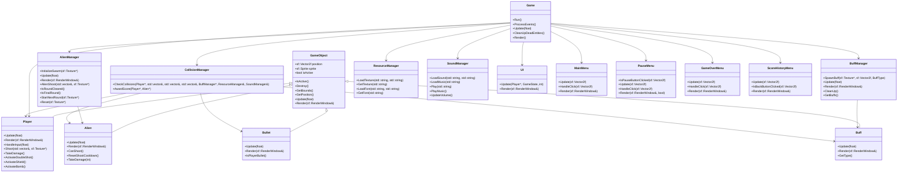

# Class Diagram

Đây là sơ đồ lớp chính của game dựa trên source code hiện tại.

```mermaid
classDiagram
    class GameObject {
        +sf::Vector2f position
        +sf::Sprite sprite
        +bool isActive
        +IsActive()
        +Destroy()
        +GetBounds()
        +GetPosition()
        +Update(float)
        +Render(sf::RenderWindow&)
    }

    class Player {
        +Update(float)
        +Render(sf::RenderWindow&)
        +HandleInput(float)
        +Shoot(std::vector<Bullet*>&, sf::Texture*)
        +TakeDamage()
        +ActivateDoubleShot()
        +ActivateShield()
        +ActivateBomb()
    }

    class Alien {
        +Update(float)
        +Render(sf::RenderWindow&)
        +CanShoot()
        +ResetShootCooldown()
        +TakeDamage(int)
    }

    class Bullet {
        +Update(float)
        +Render(sf::RenderWindow&)
        +IsPlayerBullet()
    }

    class Buff {
        +Update(float)
        +Render(sf::RenderWindow&)
        +GetType()
    }

    class AlienManager {
        +InitializeSwarm(sf::Texture*)
        +Update(float)
        +Render(sf::RenderWindow&)
        +AlienShoot(std::vector<Bullet*>&, sf::Texture*)
        +IsRoundCleared()
        +IsFinalRound()
        +StartNextRound(sf::Texture*)
        +Reset(sf::Texture*)
    }

    class BuffManager {
        +SpawnBuff(sf::Texture*, sf::Vector2f, BuffType)
        +Update(float)
        +Render(sf::RenderWindow&)
        +CleanUp()
        +GetBuffs()
    }

    class CollisionManager {
        +CheckCollisions(Player*, std::vector<Alien*>&, std::vector<Bullet*>&, std::vector<Buff*>&, BuffManager*, ResourceManager&, SoundManager&)
        +AwardScore(Player*, Alien*)
    }

    class ResourceManager {
        +LoadTexture(std::string, std::string)
        +GetTexture(std::string)
        +LoadFont(std::string, std::string)
        +GetFont(std::string)
    }

    class SoundManager {
        +LoadSound(std::string, std::string)
        +LoadMusic(std::string)
        +Play(std::string)
        +PlayMusic()
        +UpdateVolume()
    }

    class UI {
        +Update(Player*, GameState, int)
        +Render(sf::RenderWindow&)
    }

    class MainMenu {
        +Update(sf::Vector2f)
        +HandleClick(sf::Vector2f)
        +Render(sf::RenderWindow&)
    }

    class PauseMenu {
        +IsPauseButtonClicked(sf::Vector2f)
        +Update(sf::Vector2f)
        +HandleClick(sf::Vector2f)
        +Render(sf::RenderWindow&, bool)
    }

    class GameOverMenu {
        +Update(sf::Vector2f)
        +HandleClick(sf::Vector2f)
        +Render(sf::RenderWindow&)
    }

    class ScoreHistoryMenu {
        +Update(sf::Vector2f)
        +IsBackButtonClicked(sf::Vector2f)
        +Render(sf::RenderWindow&)
    }

    class Game {
        +Run()
        +ProcessEvents()
        +Update(float)
        +CleanUpDeadEntities()
        +Render()
    }

    GameObject <|-- Player
    GameObject <|-- Alien
    GameObject <|-- Bullet
    GameObject <|-- Buff
    Game --> ResourceManager
    Game --> Player
    Game --> AlienManager
    Game --> BuffManager
    Game --> CollisionManager
    Game --> UI
    Game --> SoundManager
    Game --> MainMenu
    Game --> PauseMenu
    Game --> GameOverMenu
    Game --> ScoreHistoryMenu
    AlienManager --> Alien
    BuffManager --> Buff
    CollisionManager --> Player
    CollisionManager --> Alien
    CollisionManager --> Bullet
    CollisionManager --> Buff
```

Sơ đồ này thể hiện quan hệ kế thừa và phụ thuộc giữa các lớp chính của game.