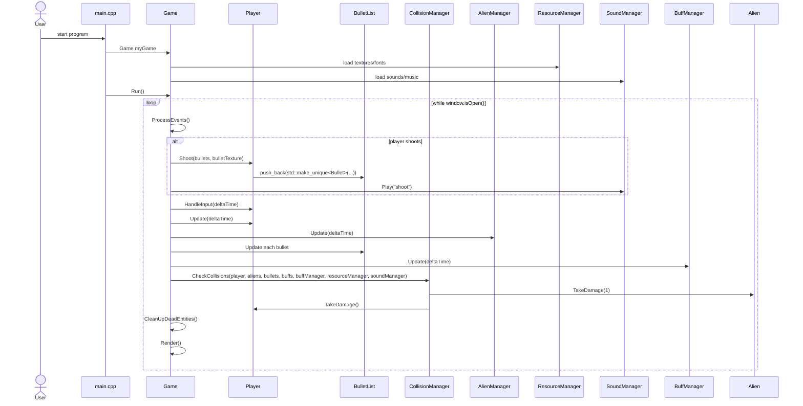
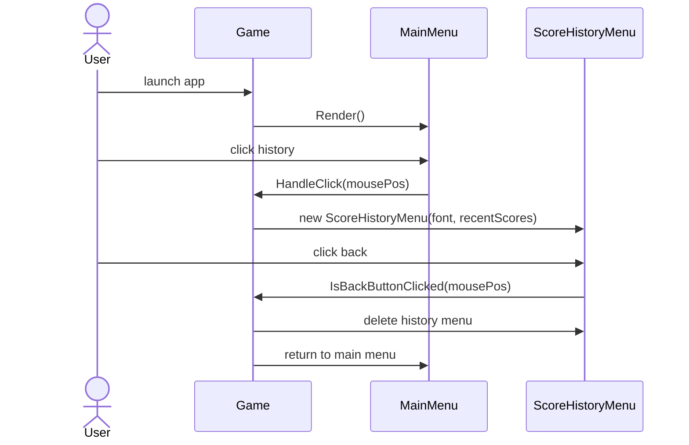

# Sequence Diagrams

## Game Loop and Shooting Sequence

```mermaid
sequenceDiagram
    actor User
    participant Main as main.cpp
    participant Game
    participant Player
    participant Bullets as BulletList
    participant Collision as CollisionManager
    participant Aliens as AlienManager

    User ->> Main: start program
    Main ->> Game: Game myGame
    Game ->> ResourceManager: load textures/fonts
    Game ->> SoundManager: load sounds/music
    Main ->> Game: Run()

    loop while window.isOpen()
        Game ->> Game: ProcessEvents()
        alt player shoots
            Game ->> Player: Shoot(bullets, bulletTexture)
            Player ->> Bullets: push_back(std::make_unique<Bullet>(...))
            Game ->> SoundManager: Play("shoot")
        end
        Game ->> Player: HandleInput(deltaTime)
        Game ->> Player: Update(deltaTime)
        Game ->> Aliens: Update(deltaTime)
        Game ->> Bullets: Update each bullet
        Game ->> BuffManager: Update(deltaTime)
        Game ->> Collision: CheckCollisions(player, aliens, bullets, buffs, buffManager, resourceManager, soundManager)
        Collision ->> Alien: TakeDamage(1)
        Collision ->> Player: TakeDamage()
        Game ->> Game: CleanUpDeadEntities()
        Game ->> Game: Render()
    end
```

## Main Menu Interaction

```mermaid
sequenceDiagram
    actor User
    participant Game
    participant MainMenu
    participant History as ScoreHistoryMenu

    User ->> Game: launch app
    Game ->> MainMenu: Render()
    User ->> MainMenu: click history
    MainMenu ->> Game: HandleClick(mousePos)
    Game ->> History: new ScoreHistoryMenu(font, recentScores)
    User ->> History: click back
    History ->> Game: IsBackButtonClicked(mousePos)
    Game ->> History: delete history menu
    Game ->> MainMenu: return to main menu
```

Các sơ đồ trình tự này mô tả luồng call chính trong vòng lặp game và menu.