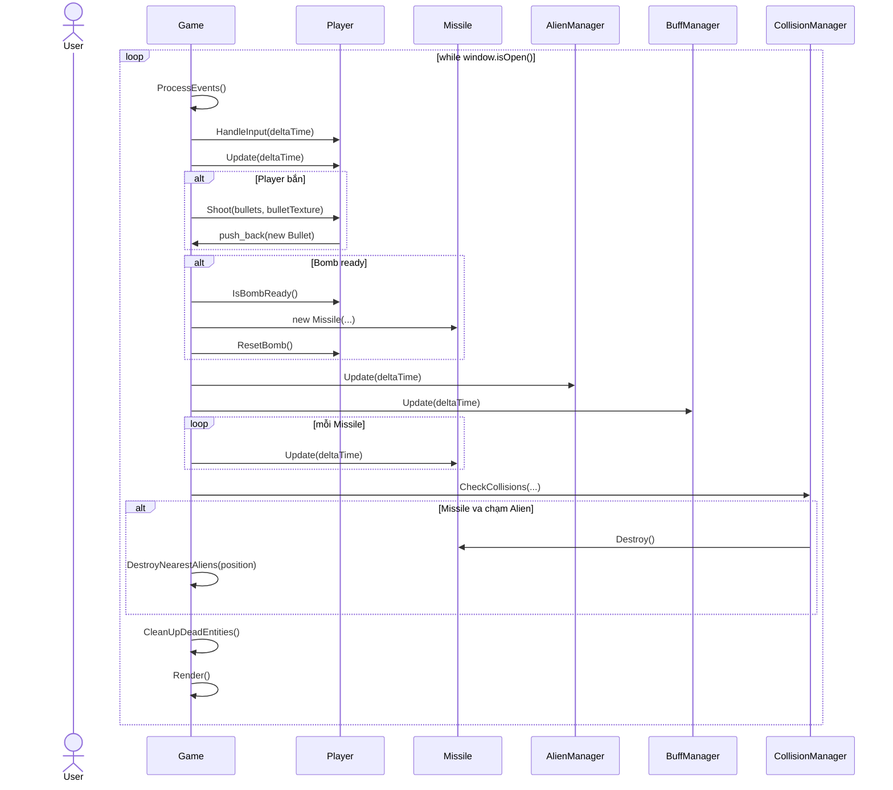

# Sequence Diagrams

## Game Loop and Shooting Sequence

```mermaid
sequenceDiagram
    actor User
    participant Game
    participant Player
    participant Missile
    participant Aliens as AlienManager
    participant BuffManager
    participant Collision as CollisionManager

    loop while window.isOpen()
        Game ->> Game: ProcessEvents()

        Game ->> Player: HandleInput(deltaTime)
        Game ->> Player: Update(deltaTime)

        alt Player bắn
            Game ->> Player: Shoot(bullets, bulletTexture)
            Player ->> Game: push_back(new Bullet)
        end

        alt Bomb ready
            Game ->> Player: IsBombReady()
            Game ->> Missile: new Missile(...)
            Game ->> Player: ResetBomb()
        end

        Game ->> Aliens: Update(deltaTime)
        Game ->> BuffManager: Update(deltaTime)

        loop mỗi Missile
            Game ->> Missile: Update(deltaTime)
        end

        Game ->> Collision: CheckCollisions(...)

        alt Missile va chạm Alien
            Collision ->> Missile: Destroy()
            Game ->> Game: DestroyNearestAliens(position)
        end

        Game ->> Game: CleanUpDeadEntities()
        Game ->> Game: Render()
    end
```
