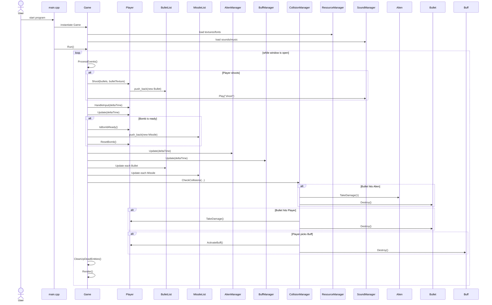
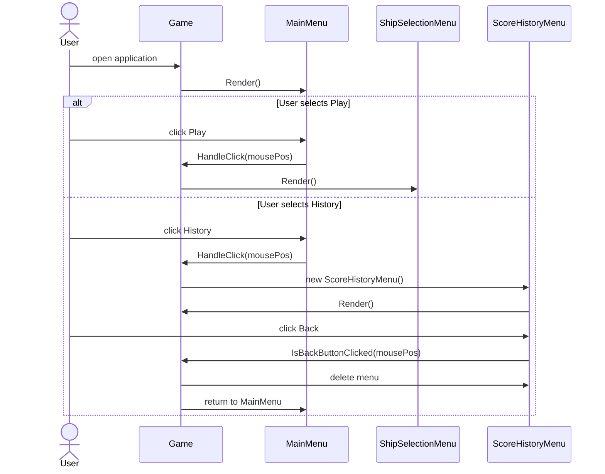
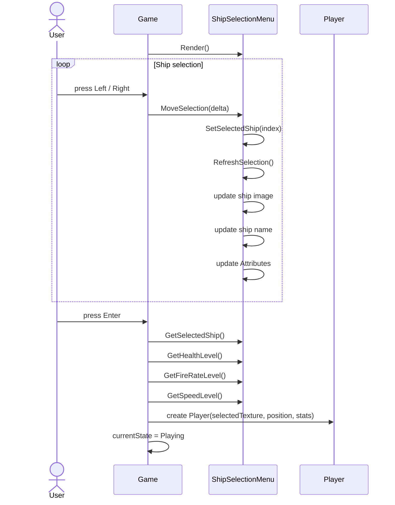
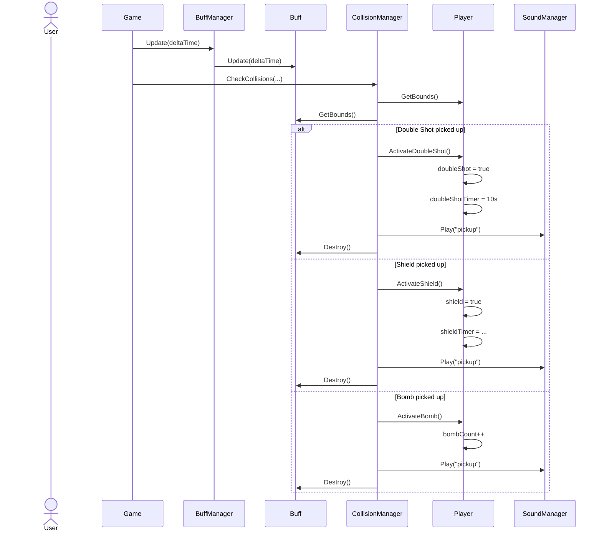
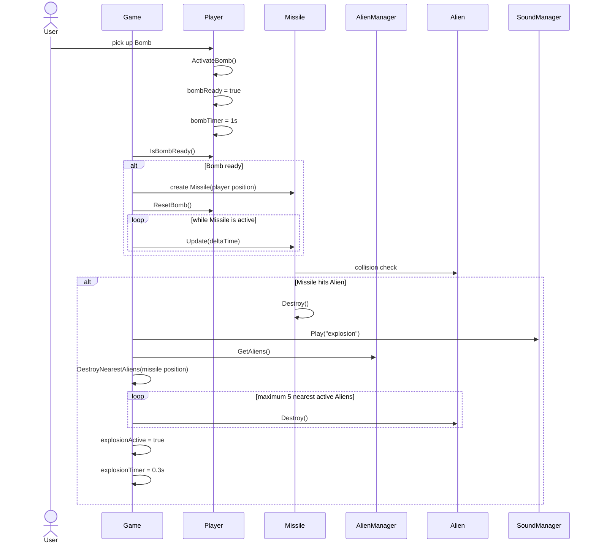
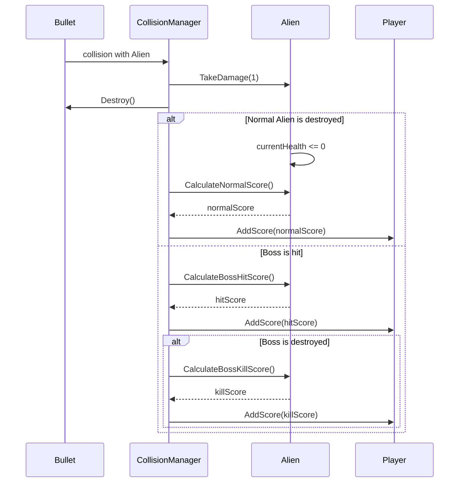
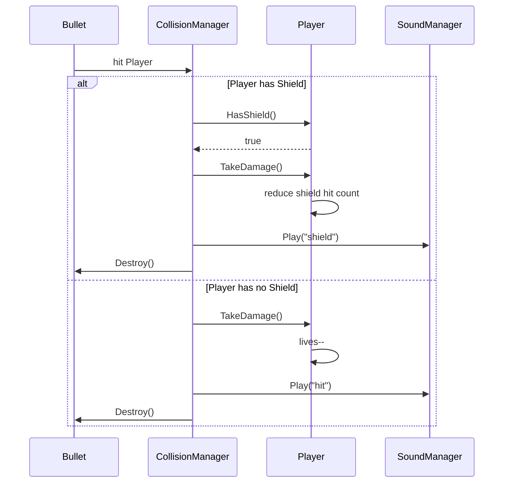
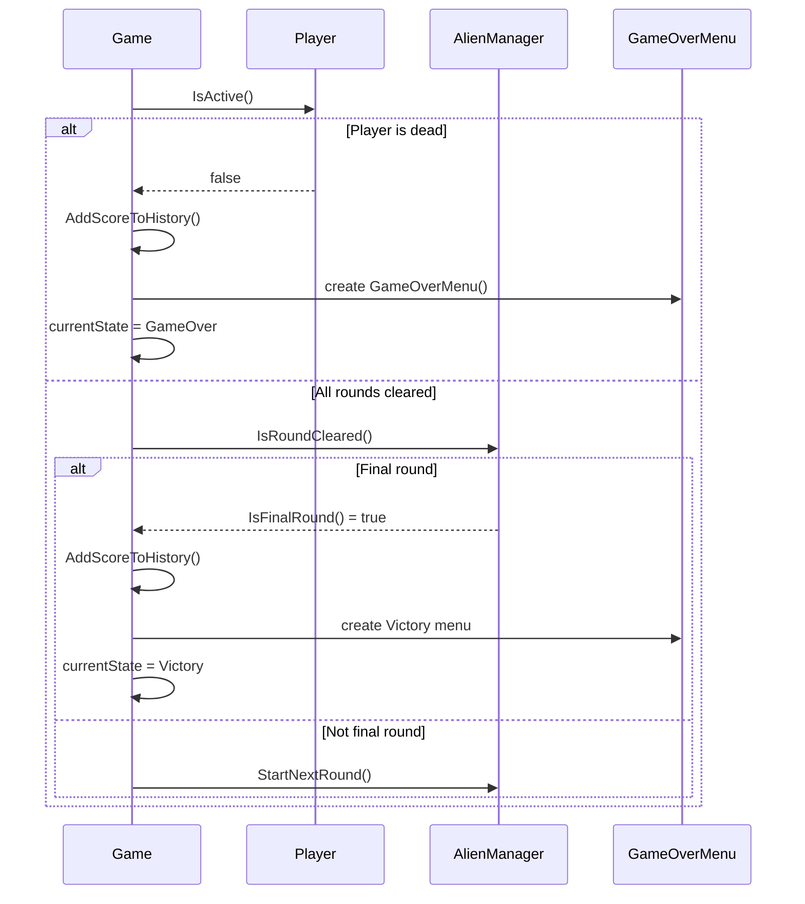

# UML Diagrams for the Game Project

## Class Diagram

```mermaid
classDiagram

    class GameObject {
        +sf::Vector2f position
        +sf::Sprite sprite
        +bool isActive
        +IsActive()
        +Destroy()
        +GetBounds()
        +GetPosition()
        +Update(float)
        +Render(sf::RenderWindow&)
    }

    class Player {
        -float speed
        -int lives
        -int score
        -float fireCooldown
        -float currentCooldown

        -int healthLevel
        -int fireRateLevel
        -int speedLevel

        -bool doubleShot
        -bool shield
        -float doubleShotTimer
        -float shieldTimer
        -int shieldHitsRemaining

        -bool bombReady
        -float bombTimer
        -int bombCount

        -bool invincible
        -float invincibleTimer
        -float blinkTimer
        -bool blinkVisible

        +Player(sf::Texture*, sf::Vector2f, int, int, int)
        +Update(float)
        +Render(sf::RenderWindow&)
        +HandleInput(float)
        +Shoot(std::vector<Bullet*>&, sf::Texture*)
        +TakeDamage()
        +ActivateDoubleShot()
        +ActivateShield()
        +ActivateBomb()
        +ResetBomb()
        +IsBombReady()
        +HasShield()
        +GetShieldTimer()
        +GetShieldHitsRemaining()
        +GetScore()
        +GetLives()
    }

    class Alien {
        -int pointValue
        -MovementType movementType
        -sf::Vector2f orbitCenter
        -float orbitRadius
        -float angle
        -float spawnDelay
        -float spawnTimer
        -bool hasSpawned
        -float aliveTimer
        -float survivalTime
        -sf::Vector2f entryStartPos
        -float shootCooldown
        -float shootTimer
        -int maxHealth
        -int currentHealth

        +Update(float)
        +Render(sf::RenderWindow&)
        +CanShoot()
        +ResetShootCooldown()
        +TakeDamage(int)
        +CalculateNormalScore()
        +CalculateBossHitScore()
        +CalculateBossKillScore()
        +GetMaxHealth()
    }

    class Bullet {
        -sf::Vector2f velocity
        -bool isPlayerBullet

        +Update(float)
        +Render(sf::RenderWindow&)
        +IsPlayerBullet()
    }

    class Missile {
        -sf::Vector2f velocity

        +Missile(sf::Texture*, sf::Vector2f)
        +Update(float)
        +Render(sf::RenderWindow&)
    }

    class Buff {
        -BuffType type
        -float fallSpeed

        +Buff(sf::Texture*, sf::Vector2f, BuffType)
        +Update(float)
        +Render(sf::RenderWindow&)
        +GetType()
    }

    class AlienManager {
        -std::vector<Alien*> aliens
        -float moveSpeed
        -bool movingRight
        -int currentRound
        -int maxRounds

        +InitializeSwarm(sf::Texture*)
        +Update(float)
        +Render(sf::RenderWindow&)
        +AlienShoot(std::vector<Bullet*>&, sf::Texture*)
        +IsRoundCleared()
        +IsFinalRound()
        +StartNextRound(sf::Texture*)
        +Reset(sf::Texture*)
        +GetAliens()
    }

    class BuffManager {
        -std::vector<Buff*> buffs

        +SpawnBuff(sf::Texture*, sf::Vector2f, BuffType)
        +Update(float)
        +Render(sf::RenderWindow&)
        +CleanUp()
        +GetBuffs()
    }

    class CollisionManager {
        +CheckCollisions(Player*, std::vector<Alien*>&, std::vector<Bullet*>&, std::vector<Buff*>&, BuffManager*, ResourceManager&, SoundManager&)
    }

    class ResourceManager {
        -std::map<std::string, sf::Texture*> textures
        -std::map<std::string, sf::Font*> fonts

        +LoadTexture(std::string, std::string)
        +GetTexture(std::string)
        +LoadFont(std::string, std::string)
        +GetFont(std::string)
    }

    class SoundManager {
        -std::map<std::string, sf::SoundBuffer*> soundBuffers
        -std::map<std::string, sf::Sound*> sounds
        -sf::Music music

        +LoadSound(std::string, std::string)
        +LoadMusic(std::string)
        +Play(std::string)
        +PlayMusic()
        +UpdateVolume()
    }

    class UI {
        -sf::Font* font
        -sf::Text scoreText
        -sf::Text livesText
        -sf::Text shieldText
        -sf::Text doubleShotText
        -sf::Text titleText
        -sf::Text subText
        -sf::Text scoreResultText
        -sf::RectangleShape overlay
        -GameState state

        +Update(Player*, GameState, int)
        +Render(sf::RenderWindow&)
    }

    class MainMenu {
        -sf::Font* font
        -sf::Sprite* bgSprite

        +Update(sf::Vector2f)
        +HandleClick(sf::Vector2f)
        +Render(sf::RenderWindow&)
        +SetVolume(int, bool)
    }

    class ShipSelectionMenu {
        -sf::Font* font
        -sf::Text titleText
        -sf::Text instructionText
        -sf::Text shipNameText
        -sf::Sprite* shipSprite
        -std::vector<sf::Texture*> shipTextures
        -int selectedShip
        -sf::Vector2f shipBasePosition
        -sf::RectangleShape frameShape
        -sf::RectangleShape frameBackground

        -int healthLevel
        -int fireRateLevel
        -int speedLevel

        +ShipSelectionMenu(sf::Font*, std::vector<sf::Texture*>&)
        +Update()
        +Render(sf::RenderWindow&)
        +UpdateAnimation(float)
        +SetSelectedShip(int)
        +MoveSelection(int)
        +GetSelectedShip()
        +GetHealthLevel()
        +GetFireRateLevel()
        +GetSpeedLevel()
    }

    class PauseMenu {
        -sf::Font* font
        -sf::RectangleShape backgroundOverlay
        -sf::Sprite* menuBgSprite
        -sf::Sprite* pauseSprite
        -sf::Sprite* resumeSprite
        -sf::Sprite* homeSprite
        -sf::Sprite* muteSprite
        -sf::Sprite* minusSprite
        -sf::Sprite* plusSprite
        -sf::Text volumeText
        -float volume
        -bool isMuted

        +IsPauseButtonClicked(sf::Vector2f)
        +Update(sf::Vector2f)
        +HandleClick(sf::Vector2f)
        +Render(sf::RenderWindow&, bool)
    }

    class GameOverMenu {
        -sf::Font* font
        -sf::Sprite* titleSprite
        -sf::Text finalScoreText
        -sf::Sprite* restartSprite
        -sf::Sprite* menuSprite

        +Update(sf::Vector2f)
        +HandleClick(sf::Vector2f)
        +Render(sf::RenderWindow&)
    }

    class ScoreHistoryMenu {
        -sf::Font* font
        -sf::RectangleShape backgroundOverlay
        -sf::Sprite* menuBgSprite
        -sf::Text titleText
        -sf::Sprite* backSprite
        -std::vector<sf::Text> scoreTexts

        +Update(sf::Vector2f)
        +IsBackButtonClicked(sf::Vector2f)
        +Render(sf::RenderWindow&)
    }

    class Game {
        -sf::RenderWindow window
        -sf::View gameView

        -ResourceManager resourceManager
        -Player* player
        -AlienManager* alienManager

        -std::vector<Bullet*> bullets
        -std::vector<Missile*> missiles

        -BuffManager* buffManager
        -CollisionManager collisionManager

        -UI* gameUI
        -SoundManager soundManager

        -sf::Sprite* backgroundSprite
        -sf::Sprite* explosionSprite
        -sf::Sprite* shieldSprite

        -GameState currentState
        -int highScore

        -MainMenu* mainMenu
        -ShipSelectionMenu* shipSelectionMenu
        -PauseMenu* pauseMenu
        -GameOverMenu* gameOverMenu
        -ScoreHistoryMenu* scoreHistoryMenu

        -std::vector<sf::Texture*> shipTextures
        -int selectedShip

        -bool isPaused
        -bool viewingHistory
        -std::vector<int> matchHistory

        -bool explosionActive
        -float explosionTimer

        +Run()
        +ProcessEvents()
        +Update(float)
        +CleanUpDeadEntities()
        +Render()
        +RestartGame()
        +DestroyNearestAliens(sf::Vector2f)
    }


    GameObject <|-- Player
    GameObject <|-- Alien
    GameObject <|-- Bullet
    GameObject <|-- Missile
    GameObject <|-- Buff

    Game --> ResourceManager
    Game --> Player
    Game --> AlienManager
    Game --> BuffManager
    Game --> CollisionManager
    Game --> UI
    Game --> SoundManager
    Game --> MainMenu
    Game --> ShipSelectionMenu
    Game --> PauseMenu
    Game --> GameOverMenu
    Game --> ScoreHistoryMenu
    Game --> Missile

    AlienManager --> Alien
    BuffManager --> Buff

    CollisionManager --> Player
    CollisionManager --> Alien
    CollisionManager --> Bullet
    CollisionManager --> Buff
    CollisionManager --> BuffManager
    CollisionManager --> ResourceManager
    CollisionManager --> SoundManager
```

---

# Sequence Diagram

## 1. Game Loop and Shooting Sequence

---

# 2. Main Menu Interaction

---

# 3. Ship Selection Sequence

---

# 4. Buff Pickup Sequence

---

# 5. Missile / Bomb Sequence

---

# 6. Scoring Sequence

---

# 7. Shield and Player Damage Sequence

---

## 8. Game Over / Victory Sequence

