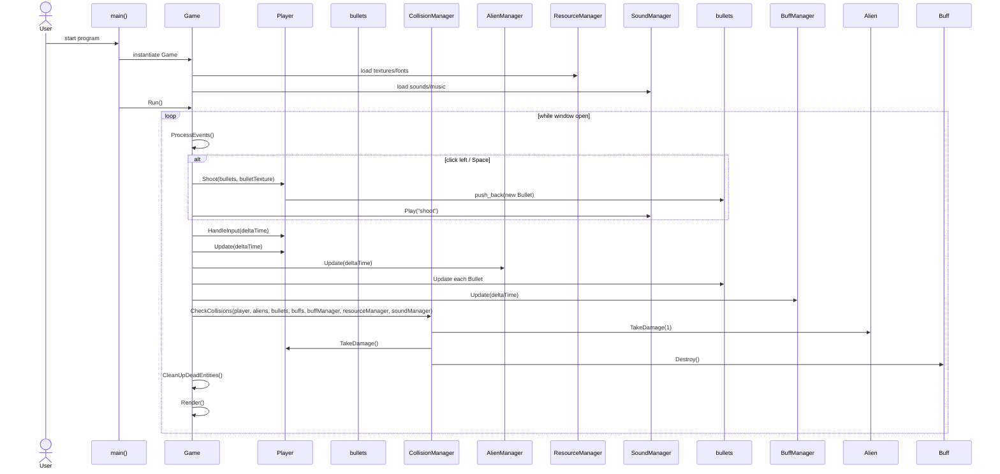
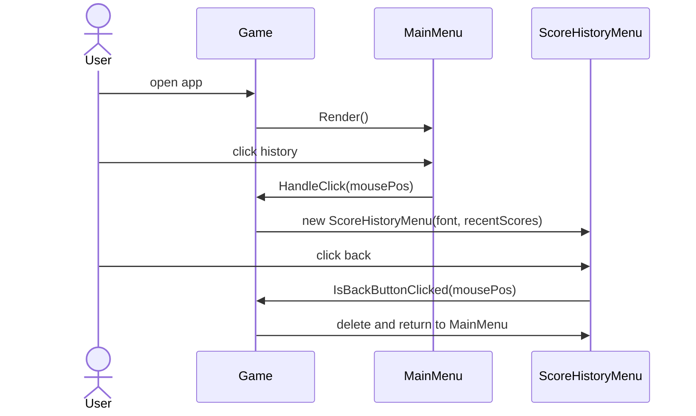

# UML Diagrams for the Game Project

## Class Diagram

```mermaid
classDiagram
    class GameObject {
        +sf::Vector2f position
        +sf::Sprite sprite
        +bool isActive
        +IsActive()
        +Destroy()
        +GetBounds()
        +GetPosition()
        +Update(float)
        +Render(sf::RenderWindow&)
    }

    class Player {
        -float speed
        -int lives
        -int score
        -float fireCooldown
        -float currentCooldown
        -bool doubleShot
        -bool shield
        -float doubleShotTimer
        -float shieldTimer
        -int shieldHitsRemaining
        -bool bombReady
        -float bombTimer
        -int bombCount
        +Update(float)
        +Render(sf::RenderWindow&)
        +HandleInput(float)
        +Shoot(std::vector<Bullet*>&, sf::Texture*)
        +TakeDamage()
        +ActivateDoubleShot()
        +ActivateShield()
        +ActivateBomb()
    }

    class Alien {
        -int pointValue
        -MovementType movementType
        -sf::Vector2f orbitCenter
        -float orbitRadius
        -float angle
        -float spawnDelay
        -float spawnTimer
        -bool hasSpawned
        -float aliveTimer
        -float survivalTime
        -sf::Vector2f entryStartPos
        -float shootCooldown
        -float shootTimer
        -int maxHealth
        -int currentHealth
        +Update(float)
        +Render(sf::RenderWindow&)
        +CanShoot()
        +ResetShootCooldown()
        +TakeDamage(int)
    }

    class Bullet {
        -sf::Vector2f velocity
        -bool isPlayerBullet
        +Update(float)
        +Render(sf::RenderWindow&)
        +IsPlayerBullet()
    }

    class Buff {
        -BuffType type
        -float fallSpeed
        +Update(float)
        +Render(sf::RenderWindow&)
        +GetType()
    }

    class AlienManager {
        -std::vector<Alien*> aliens
        -float moveSpeed
        -bool movingRight
        -int currentRound
        -int maxRounds
        +InitializeSwarm(sf::Texture*)
        +Update(float)
        +Render(sf::RenderWindow&)
        +AlienShoot(std::vector<Bullet*>&, sf::Texture*)
        +IsRoundCleared()
        +IsFinalRound()
        +StartNextRound(sf::Texture*)
        +Reset(sf::Texture*)
    }

    class BuffManager {
        -std::vector<Buff*> buffs
        +SpawnBuff(sf::Texture*, sf::Vector2f, BuffType)
        +Update(float)
        +Render(sf::RenderWindow&)
        +CleanUp()
        +GetBuffs()
    }

    class CollisionManager {
        +CheckCollisions(Player*, std::vector<Alien*>&, std::vector<Bullet*>&, std::vector<Buff*>&, BuffManager*, ResourceManager&, SoundManager&)
        +AwardScore(Player*, Alien*)
    }

    class ResourceManager {
        -std::map<std::string, sf::Texture*> textures
        -std::map<std::string, sf::Font*> fonts
        +LoadTexture(std::string, std::string)
        +GetTexture(std::string)
        +LoadFont(std::string, std::string)
        +GetFont(std::string)
    }

    class SoundManager {
        -std::map<std::string, sf::SoundBuffer*> soundBuffers
        -std::map<std::string, sf::Sound*> sounds
        -sf::Music music
        +LoadSound(std::string, std::string)
        +LoadMusic(std::string)
        +Play(std::string)
        +PlayMusic()
        +UpdateVolume()
    }

    class UI {
        -sf::Font* font
        -sf::Text scoreText
        -sf::Texture heartTexture
        -sf::Text shieldText
        -sf::Texture shieldTexture
        -sf::Text doubleShotText
        -sf::Texture doubleShotTexture
        -sf::Text titleText
        -sf::Text subText
        -sf::Text scoreResultText
        -sf::RectangleShape overlay
        -GameState state
        +Update(Player*, GameState, int)
        +Render(sf::RenderWindow&)
    }

    class MainMenu {
        -sf::Font* font
        -sf::Sprite* bgSprite
        +Update(sf::Vector2f)
        +HandleClick(sf::Vector2f)
        +Render(sf::RenderWindow&)
        +SetVolume(int, bool)
    }

    class PauseMenu {
        -sf::Font* font
        -sf::RectangleShape backgroundOverlay
        -sf::Sprite* menuBgSprite
        -sf::Sprite* pauseSprite
        -sf::Sprite* resumeSprite
        -sf::Sprite* homeSprite
        -sf::Sprite* muteSprite
        -sf::Sprite* minusSprite
        -sf::Sprite* plusSprite
        -sf::Text volumeText
        -float volume
        -bool isMuted
        +IsPauseButtonClicked(sf::Vector2f)
        +Update(sf::Vector2f)
        +HandleClick(sf::Vector2f)
        +Render(sf::RenderWindow&, bool)
    }

    class GameOverMenu {
        -sf::Font* font
        -sf::Sprite* titleSprite
        -sf::Text finalScoreText
        -sf::Sprite* restartSprite
        -sf::Sprite* menuSprite
        +Update(sf::Vector2f)
        +HandleClick(sf::Vector2f)
        +Render(sf::RenderWindow&)
    }

    class ScoreHistoryMenu {
        -sf::Font* font
        -sf::RectangleShape backgroundOverlay
        -sf::Sprite* menuBgSprite
        -sf::Text titleText
        -sf::Sprite* backSprite
        -std::vector<sf::Text> scoreTexts
        +Update(sf::Vector2f)
        +IsBackButtonClicked(sf::Vector2f)
        +Render(sf::RenderWindow&)
    }

    class Game {
        -sf::RenderWindow window
        -sf::View gameView
        -ResourceManager resourceManager
        -Player* player
        -AlienManager* alienManager
        -std::vector<Bullet*> bullets
        -std::vector<Missile*> missiles
        -BuffManager* buffManager
        -CollisionManager collisionManager
        -UI* gameUI
        -SoundManager soundManager
        -sf::Sprite* backgroundSprite
        -sf::Sprite* explosionSprite
        -sf::Sprite* shieldSprite
        -GameState currentState
        -int highScore
        -MainMenu* mainMenu
        -GameOverMenu* gameOverMenu
        -PauseMenu* pauseMenu
        -ScoreHistoryMenu* scoreHistoryMenu
        -bool isPaused
        -bool viewingHistory
        -std::vector<int> matchHistory
        +Run()
        +ProcessEvents()
        +Update(float)
        +CleanUpDeadEntities()
        +Render()
    }

    GameObject <|-- Player
    GameObject <|-- Alien
    GameObject <|-- Bullet
    GameObject <|-- Buff
    Game --> ResourceManager
    Game --> Player
    Game --> AlienManager
    Game --> BuffManager
    Game --> CollisionManager
    Game --> UI
    Game --> SoundManager
    Game --> MainMenu
    Game --> PauseMenu
    Game --> GameOverMenu
    Game --> ScoreHistoryMenu
    AlienManager --> Alien
    BuffManager --> Buff
    CollisionManager --> Player
    CollisionManager --> Alien
    CollisionManager --> Bullet
    CollisionManager --> Buff
```

## Sequence Diagram

### Game loop and shooting sequence

```mermaid
sequenceDiagram
    actor User
    participant main.cpp as main()
    participant Game
    participant Player
    participant BulletList as bullets
    participant Collision as CollisionManager
    participant AlienManager

    User ->> main.cpp: start program
    main.cpp ->> Game: instantiate Game
    Game ->> ResourceManager: load textures/fonts
    Game ->> SoundManager: load sounds/music
    main.cpp ->> Game: Run()

    loop while window open
        Game ->> Game: ProcessEvents()
        alt click left / Space
            Game ->> Player: Shoot(bullets, bulletTexture)
            Player ->> bullets: push_back(new Bullet)
            Game ->> SoundManager: Play("shoot")
        end
        Game ->> Player: HandleInput(deltaTime)
        Game ->> Player: Update(deltaTime)
        Game ->> AlienManager: Update(deltaTime)
        Game ->> bullets: Update each Bullet
        Game ->> BuffManager: Update(deltaTime)
        Game ->> Collision: CheckCollisions(player, aliens, bullets, buffs, buffManager, resourceManager, soundManager)
        Collision ->> Alien: TakeDamage(1)
        Collision ->> Player: TakeDamage()
        Collision ->> Buff: Destroy()
        Game ->> Game: CleanUpDeadEntities()
        Game ->> Game: Render()
    end
```

### Menu interaction sequence

```mermaid
sequenceDiagram
    actor User
    participant Game
    participant MainMenu
    participant ScoreHistoryMenu

    User ->> Game: open app
    Game ->> MainMenu: Render()
    User ->> MainMenu: click history
    MainMenu ->> Game: HandleClick(mousePos)
    Game ->> ScoreHistoryMenu: new ScoreHistoryMenu(font, recentScores)
    User ->> ScoreHistoryMenu: click back
    ScoreHistoryMenu ->> Game: IsBackButtonClicked(mousePos)
    Game ->> ScoreHistoryMenu: delete and return to MainMenu
```
